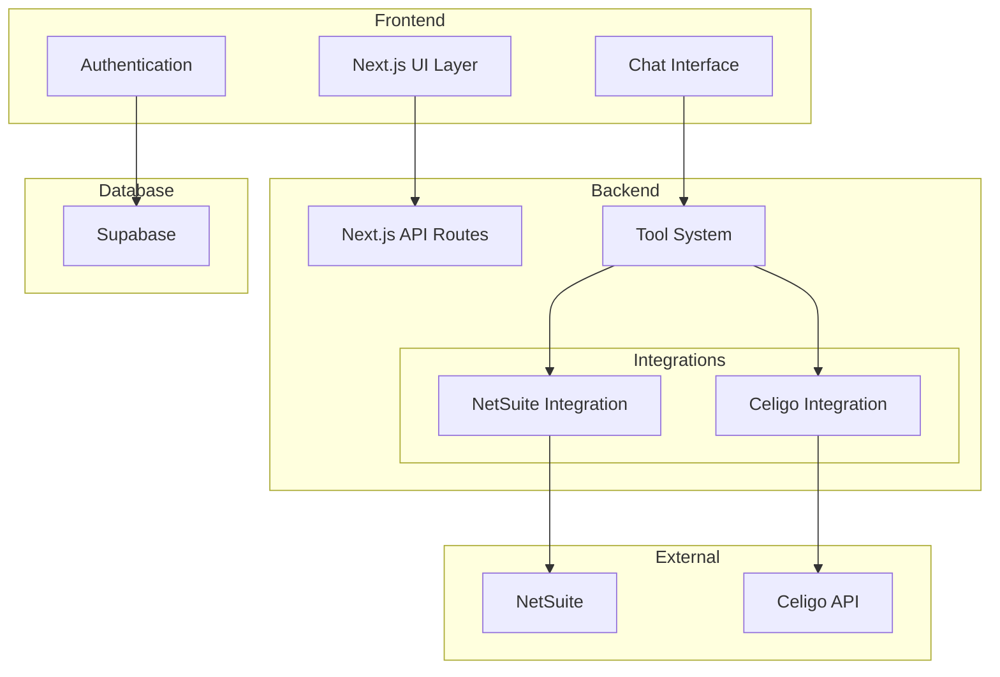
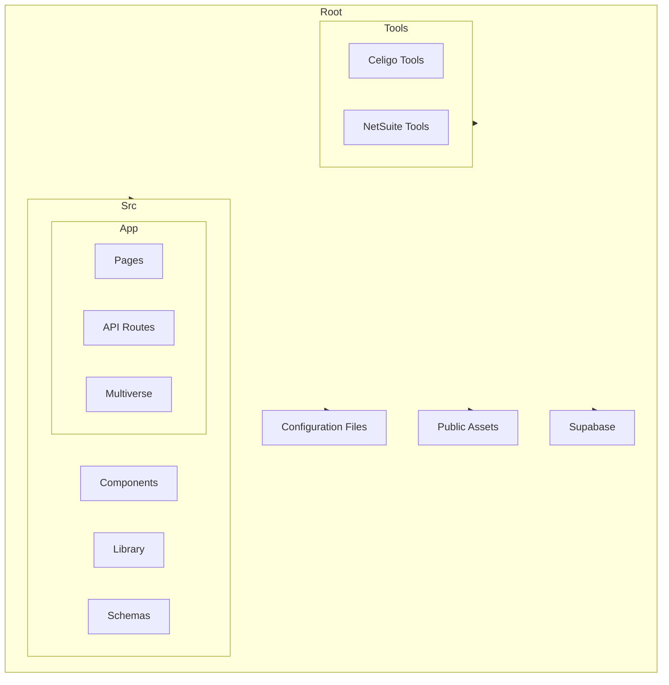

# AI Interface Project Documentation

## Table of Contents
- [Project Overview](#project-overview)
- [Architecture](#architecture)
- [File Structure](#file-structure)
- [Setup Guide](#setup-guide)
- [Integration Details](#integration-details)

## Project Overview
AI Interface is a Next.js application that provides an intelligent interface for integrating with NetSuite and Celigo. It features a chat-based interface for interacting with these systems and managing integrations.

### Key Features
- Chat-based interface for system interaction
- NetSuite integration with OAuth 2.0 authentication
- Celigo integration for advanced workflow automation
- Multi-session support for parallel operations
- Real-time updates and live chat interface
- Extensible tool system for integration management
- Secure authentication and authorization
- Database persistence with Supabase

### Tech Stack
- **Frontend**: Next.js 14, TypeScript, Tailwind CSS
- **Backend**: Next.js API Routes, Supabase
- **Authentication**: OAuth 2.0, Supabase Auth
- **Integrations**: NetSuite, Celigo
- **Database**: Supabase (PostgreSQL)
- **Styling**: Tailwind CSS, Shadcn UI

## Architecture

### System Architecture


### Repository Structure


## File Structure

### Root Directory
```
/
├── public/                 # Static assets
│   ├── integriverse/      # Integriverse-specific assets
│   └── logos/             # Integration logos (NetSuite, Celigo, etc.)
├── src/                   # Source code
├── tools/                 # Integration tools
├── supabase/             # Database migrations
└── [Configuration Files] # Project configuration (next.config.ts, etc.)
```

### Source Code (`/src`)
```
src/
├── app/                   # Next.js app directory
│   ├── api/              # API routes
│   │   └── multiverse/   # Multiverse API endpoints
│   ├── auth/             # Authentication routes
│   │   ├── callback/     # OAuth callback handlers
│   │   └── netsuite/     # NetSuite auth endpoints
│   ├── multiverse/       # Chat interface
│   ├── connections/      # Connection management
│   ├── dashboard/        # User dashboard
│   └── settings/         # User settings
├── components/           # Reusable components
│   ├── ui/              # UI components (buttons, cards, etc.)
│   └── connections/     # Connection-specific components
├── lib/                 # Utility functions
│   ├── supabase.ts     # Supabase client
│   ├── netsuite.ts     # NetSuite utilities
│   └── utils.ts        # General utilities
└── schemas/            # Data schemas
```

### Multiverse Components (`/src/app/multiverse`)
```
multiverse/
├── components/
│   ├── chat/           # Chat-specific components
│   │   ├── message.tsx        # Message component
│   │   ├── step-indicator.tsx # Step indicator
│   │   └── memoized-markdown.tsx # Markdown renderer
│   └── layout/         # Layout components
│       ├── ChatHeader.tsx    # Chat header
│       ├── ChatInput.tsx     # Chat input
│       ├── ChatMessages.tsx  # Messages container
│       └── ChatSidebar.tsx   # Chat sidebar
├── hooks/              # Custom React hooks
│   ├── useAddons.ts         # Addons management
│   ├── useChatSessions.ts   # Chat session management
│   └── useMultiverseChat.ts # Chat functionality
└── types/              # TypeScript types
    └── chat.ts         # Chat-related types
```

### Tools Directory (`/tools`)
```
tools/
├── celigo/             # Celigo integration
│   ├── connection/     # Connection management
│   │   ├── http/      # HTTP connection handlers
│   │   ├── netsuite/  # NetSuite connection handlers
│   │   └── schemas/   # Connection schemas
│   ├── flow/          # Flow management
│   ├── http/          # HTTP tools
│   ├── import/        # Import tools
│   ├── integration/   # Integration tools
│   └── shared/        # Shared utilities
└── netsuite-saved-search.ts  # NetSuite search tools
```

## Setup Guide

### Prerequisites
- Node.js 18 or higher
- NetSuite account with administrator access
- Celigo account with API access
- Supabase project

### Environment Setup

1. **Clone the repository and install dependencies**
```bash
git clone <repository-url>
cd ai-interface
npm install
```

2. **Configure environment variables**
Create a `.env.local` file with:
```env
# Supabase Configuration
NEXT_PUBLIC_SUPABASE_URL=your_supabase_url
NEXT_PUBLIC_SUPABASE_ANON_KEY=your_supabase_anon_key

# NetSuite Configuration
NETSUITE_CLIENT_ID=your_client_id
NETSUITE_CLIENT_SECRET=your_client_secret

# Other configurations as needed
```

3. **NetSuite OAuth Setup**
- Log in to NetSuite account
- Go to Setup > Integration > Integration Management
- Create new Integration record
- Configure OAuth 2.0 settings
- Set callback URL to `http://localhost:3000/auth/netsuite/callback`

4. **Database Setup**
- Run Supabase migrations:
```bash
npx supabase migration up
```

5. **Start Development Server**
```bash
npm run dev
```

## Integration Details

### NetSuite Integration
- **Authentication**: OAuth 2.0 flow
- **Features**:
  - Saved search execution
  - Record operations (create, read, update, delete)
  - Custom field mapping
  - Batch operations support

### Celigo Integration
- **Connection Types**:
  - HTTP connections
  - NetSuite connections
  - FTP connections
  - Salesforce connections
- **Features**:
  - Flow management
  - Import/Export operations
  - Integration management
  - Error handling and logging

### API Routes
- `/api/multiverse/chat`: Main chat interface endpoint
- `/auth/*`: Authentication endpoints
- `/connections/*`: Connection management
- `/settings/*`: User settings management

## Development Workflow

1. **Local Development**
   - Run development server
   - Make changes
   - Test in browser
   - Verify integrations

2. **Testing**
   - Unit tests for components
   - Integration tests for API routes
   - End-to-end testing for flows

3. **Deployment**
   - Build application
   - Deploy to production
   - Update environment variables
   - Verify connections

## Security Considerations

1. **Authentication**
   - OAuth 2.0 for NetSuite
   - Supabase authentication
   - Secure token storage

2. **Data Protection**
   - Encrypted connections
   - Secure credential storage
   - Rate limiting
   - Input validation

3. **Best Practices**
   - Regular security updates
   - Audit logging
   - Access control
   - Error handling

## Troubleshooting

### Common Issues
1. **NetSuite Connection**
   - Verify OAuth credentials
   - Check callback URL
   - Confirm role permissions

2. **Celigo Integration**
   - Validate API access
   - Check connection settings
   - Verify flow configurations

3. **Database Issues**
   - Check Supabase connection
   - Verify migrations
   - Monitor quotas

### Support
For additional support:
- Check issue tracker
- Review documentation
- Contact system administrator
