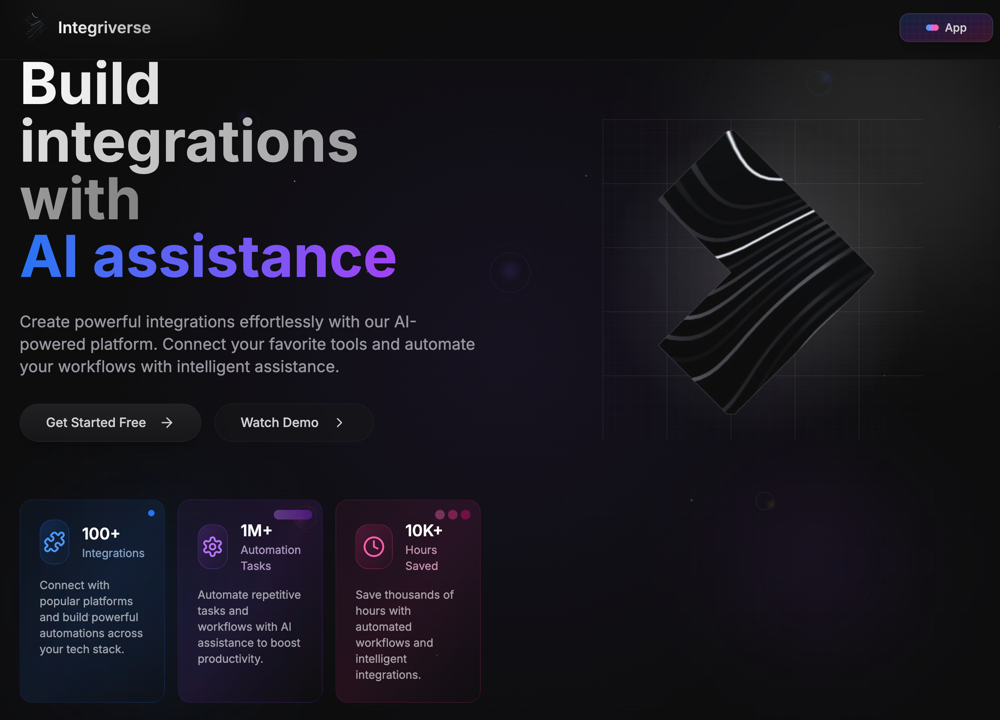

# AI Interface

[](https://github.com/drisstalainte/ai-interface/releases)
[](LICENSE)
[](https://www.typescriptlang.org/)
[](https://nextjs.org/)
[](https://tailwindcss.com/)

AI Interface is an intelligent productivity platform that seamlessly connects enterprise systems with AI capabilities. Integrate with NetSuite, Celigo, and other business platforms while leveraging generative AI for natural language interactions.



## 🚀 What's New in v1.0.6

### Added
- 📊 **Token usage tracking**: Detailed tracking with cost estimation for Claude 3.7 Sonnet
- 💰 **Usage pill**: New UI component showing token counts and estimated costs
- 🔍 **Detailed breakdown**: View input/output tokens and costs with visual breakdown

### Changed
- 🎨 **Modern UI themes**: Refreshed addon pill with contemporary teal/emerald design
- 💄 **Streamlined interfaces**: Consistent pill designs throughout the app

### Fixed
- 🐛 Fixed duplicate message saving in chat history
- 📈 Added persistent token usage data to database

[View full changelog →](CHANGELOG.md)

## ⚙️ Environment Setup

### NetSuite OAuth Configuration

1. Obtain OAuth Credentials from NetSuite:
   - Log in to your NetSuite account
   - Go to Setup > Integration > Integration Management > Manage Integrations
   - Create a new Integration record with the following settings:
     * Name: AI Interface
     * OAuth 2.0 Client Credentials: Check this box
     * Callback URL: `http://localhost:3000/auth/netsuite/callback` (development)
     * Application ID: Will be generated automatically
     * Consumer Key/Client ID: Will be generated automatically
     * Consumer Secret/Client Secret: Will be generated automatically

2. Configure Environment Variables:
   Copy the `.env.local.example` file to `.env.local` and update the following variables:
   ```
   NETSUITE_CLIENT_ID=your_client_id_here      # Consumer Key/Client ID from NetSuite
   NETSUITE_CLIENT_SECRET=your_client_secret_here  # Consumer Secret/Client Secret from NetSuite
   ```

3. Important Security Notes:
   - Never commit `.env.local` to version control
   - Keep your Client ID and Secret secure
   - Use different Integration records for development and production
   - Update the callback URL in production to match your deployed domain

4. Troubleshooting:
   - Ensure the Integration record is enabled in NetSuite
   - Verify the callback URL matches exactly
   - Check that the role has appropriate permissions
   - Ensure the account ID is correct when connecting

### Required Environment Variables

```env
# NetSuite Configuration
NETSUITE_CLIENT_ID=your_client_id_here
NETSUITE_CLIENT_SECRET=your_client_secret_here
NETSUITE_ACCOUNT_ID=your_netsuite_account_id
NEXT_PUBLIC_NETSUITE_REDIRECT_URI=http://localhost:3000/auth/netsuite/callback

# SuiteQL Configuration
NETSUITE_SUITEQL_SCRIPT_ID=customscript_integrivers_suiteql_api
NETSUITE_SUITEQL_DEPLOY_ID=customdeploy1

# Supabase Configuration
NEXT_PUBLIC_SUPABASE_URL=your_supabase_url
NEXT_PUBLIC_SUPABASE_ANON_KEY=your_supabase_anon_key

# AI Provider Configuration
ANTHROPIC_API_KEY=your_anthropic_api_key
```

## 🚀 Getting Started

### Prerequisites

- Node.js 18.17.0 or later
- npm or yarn
- Supabase account
- NetSuite account with integration access

### Installation

1. Clone the repository
   ```bash
   git clone https://github.com/yourusername/ai-interface.git
   cd ai-interface
   ```

2. Install dependencies
   ```bash
   npm install
   # or
   yarn install
   ```

3. Set up environment variables by copying the example file
   ```bash
   cp .env.example .env.local
   # Edit .env.local with your credentials
   ```

4. Start the development server
   ```bash
   npm run dev
   # or
   yarn dev
   ```

5. Open [http://localhost:3000](http://localhost:3000) in your browser

## 🧩 Features

- **NetSuite Integration**: Connect to your NetSuite environment
  - OAuth 2.0 authentication flow
  - Saved Search tool for complex record retrieval
  - SuiteQL tool for SQL-like queries against NetSuite data
  
- **Celigo Integration**: Manage Celigo integrations through natural language
  - Connection management
  - Import and export configuration
  - Flow management

- **AI Chat Interface**: Natural language interactions with integrated systems
  - Context-aware conversation with tools
  - Markdown rendering with syntax highlighting
  - Table formatting with CSV export

## 📖 Documentation

For more detailed information about using the platform, refer to our [documentation](docs/).

## 🤝 Contributing

Contributions are welcome! Please feel free to submit a Pull Request.

## 📄 License

This project is licensed under the MIT License - see the [LICENSE](LICENSE) file for details.

## 🔗 Links

- [Changelog](CHANGELOG.md)
- [Project Roadmap](PROJECT.md)
- [NetSuite Developer Resources](https://developer.oracle.com/netsuite)
